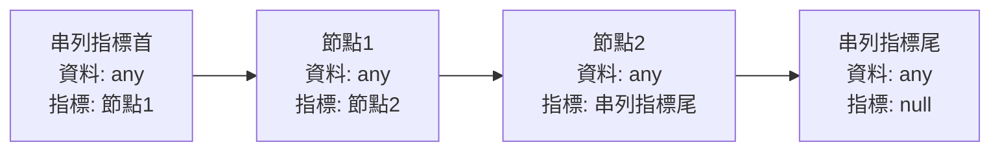

# 串列結構

串列（Linked List）或稱「鏈結串列」，是由許多相同資料型態的項目，依特定順序排列而成的線性串列。

-   特性：記憶體位置不連續、隨機儲存。
-   優點：方便於資料的插入或刪除，有新資料就向系統要一塊記憶體空間，資料刪除後就把記憶體空間還給系統，不需要移動大量資料。
-   缺點：設計資料結構較為麻煩，搜尋資料無法隨機讀取，須從特定節點開始遍歷，直至目標資料。

## 動態配置記憶體

與陣列最大的差別，串列的各個元素不必是分配在連續的記憶體上。

「動態配置記憶體」（dynamic allocation）讓記憶體運用更為彈性，可於程式執行期間，依照使用者的需求，適當配置所需記憶體空間。

靜態及動態配置相比較：

| 相關比較表       | 動態配置                                                                                                               | 靜態配置                             |
| ---------------- | ---------------------------------------------------------------------------------------------------------------------- | ------------------------------------ |
| 記憶體配置       | 執行階段                                                                                                               | 編譯階段                             |
| 記憶體釋放       | 程式結束前必須釋放，否則會造成記憶體缺口。                                                                             | 不須釋放，程式結束自動歸還系統。     |
| 程式執行效能     | 較慢，因所需記憶體逼須於程式執行時才能配置。                                                                           | 較快，編譯階段已決定記憶體所需容量。 |
| 指標遺失配置位置 | 若指向動態配置空間的指標，在未釋放該位置空間前，又指向別的記憶體空間時，原本所指向的空間將無法被釋放，造成記憶體缺口。 | -                                    |

## 單向鏈結串列

「單向鏈結串列」（Single Linked List），由串列節點組成，一個節點有兩個欄位，分別是*資料欄*與*指標欄*，資料欄會儲存該節點所擁有的資料，而指標欄會指向下個節點的記憶體所在位置。

單向鏈結串列中，第一個節點叫「串列指標首」，而指標欄為 `null` 的節點叫「串列指標尾」：



雖然所有節點都知道下一個節點在哪，但卻不知道前一個節點的位置，因此在串列操作中「串列指標首」相當重要，只要首位存在，即可對整個串列進行走、加入即刪除節點，除非必要否則不可以移動串列指標首。

在其他 C 系列語言，是以「指標」（pointer）型態來處理串列型態的結構，但 C# 預設不支援指標，所以可以宣告鏈結串列為類別型態：

```cs
class Node
{
    public int data;
    public Node next;
    public Node(int data) // constructor function
    {
        this.data = data;
        this.next = null;
    }
}
```

接著宣告 LinkedList 類別，並定義兩個 Node 指標，分別指向串列指標首與串列指標尾：

```cs
class LinkedList
{
    private Node first;
    private Node last;
    // 以下定義類別的方法
    // ...
}
```

### 建立單向鏈結串列

[範例](../lib/linked-list/Single.cs)：使用者輸入資料來新增學生資料節點，並建立一個單向鏈結串列，接著走訪（traverse）每個節點來列印成績。

### 單向鏈結串列刪除節點

依據欲刪除的節點，會有三種不同情境：

1. 刪除第一個節點：只要將串列指標首指向第二個節點。

    ```mermaid
    flowchart LR
        Node1 --x Node2
        oldFirst -.- Node1
        Node2 --> Node3
        newFirst -..- Node2
        Node3 --> null
        style oldFirst stroke:none,fill:none
        style newFirst stroke:none,fill:none
        style null stroke:none,fill:none
    ```

    ```cs
    if (first.data == delNode.data)
        first = first.next;
    ```

2. 刪除中間的節點：將欲刪除的節點的*前一個節點*的指標，指向欲刪除的節點的下一個節點。

    ```mermaid
    flowchart LR
        Node1 --x Node2
        Node1 ---> Node3
        delNode -.- Node2
        Node2 --> Node3
        Node3 --> null
        style delNode stroke:none,fill:none
        style null stroke:none,fill:none
    ```

    ```cs
    newNode = first;                        // 遍歷節點的暫存空間
    preNode = first;                        // 目標是要引用到欲刪除的節點的前一個節點
    while (newNode.data != delNode.data)    // 遍歷至欲刪除的節點的前一個節點為止
    {
        preNode = newNode;                  // 暫存當前節點對象，若下一節點是欲刪除的節點，迴圈會中斷
        newNode = newNode.next;             // 引用下一個節點對象
    }
    preNode.next = delNode.next;            // 將欲刪除的節點的前一個節點的指標欄，改為引用欲刪除的節點的下一個節點
    ```

3. 刪除最後一個節點：只需將指向最後一個節點的指標欄，指向 `null` 即可。

    ```mermaid
    flowchart LR
        Node1 --> Node2
        Node2 --> null1(null)
        Node2 ---x Node3
        Node3 --> null2(null)
        style null1 stroke:none,fill:none
        style null2 stroke:none,fill:none
    ```

    ```cs
    if (last.data == delNode.data)
    {
        newNode = first;                // 目標是找到倒數第二個節點
        while (newNode.next != last)    // 持續遍歷到倒數第二個節點
            newNode = newNode.next;
        newNode.next = last.next        // 將倒數第二個節點的指標欄指向最後一個節點的指標欄
        last = newNode;                 // 更換串列的指標尾為倒數第二個節點
    }
    ```

[範例](../lib/linked-list/Score.cs)：建立一組學生成績的單向鏈結串列，輸入想要刪除的座號，就可以走訪串列，並刪除該位學生的節點。

### 單向鏈結串列插入新節點

與刪除節點同樣可分為三種情況：

1. 新節點插入第一個節點前，成為串列的首節點：將新節點指標欄指向串列首節點，再將串列指標首指向新節點。

    ```mermaid
    flowchart LR
        newFirst -.- newNode
        newNode -- point to --> Node1
        oldFirst -..- Node1
        Node1 --> Node2
        Node2 --> Node3["...rest of the nodes"]
        style newFirst stroke:none,fill:none
        style oldFirst stroke:none,fill:none
        style Node3 stroke:none,fill:none
    ```

2. 新節點插入最後一個節點之後：把最後一個節點的指標欄指向新節點，新節點再指向 `null`。

    ```mermaid
    flowchart LR
        Node1 --> Node2
        Node2 --> Node3
        Node3 --x null1["null"]
        Node3 -- point to --> newNode
        oldLast -.- Node3
        newNode --> null2["null"]
        newLast -.- newNode
        style null1 stroke:none,fill:none
        style null2 stroke:none,fill:none
        style oldLast stroke:none,fill:none
        style newLast stroke:none,fill:none
    ```

3. 將新節點插入串列中間的位置：假設新節點要插入 X 與 Y 節點之間，先將新節點指向 Y：

    ```mermaid
    flowchart LR
        Node1 --> NodeX
        newNode -- point to --> NodeY
        NodeX --> NodeY
        NodeY --> rest["... rest of the nodes"]
        style rest stroke:none,fill:none
    ```

    再將 X 指向新節點：

    ```mermaid
    flowchart LR
        Node1 --> NodeX
        newNode --> NodeY
        NodeX -- point to --> newNode
        NodeY --> rest["... rest of the nodes"]
        style rest stroke:none,fill:none
    ```
