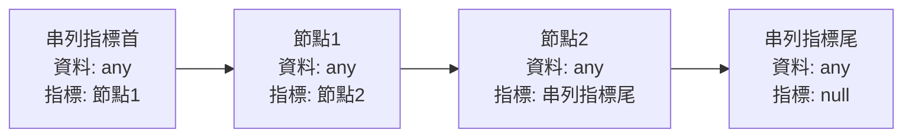
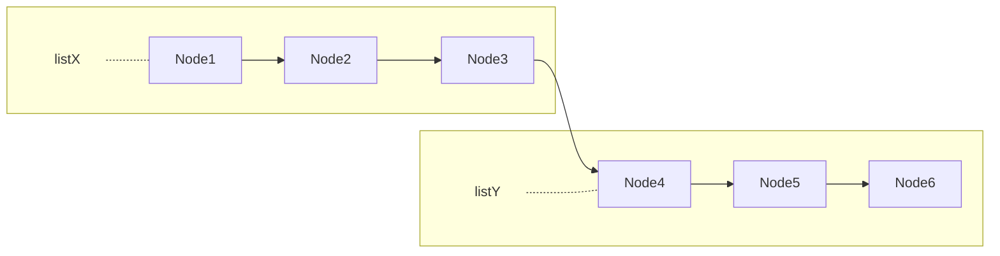
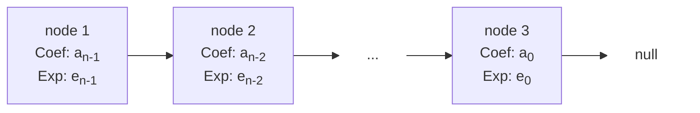
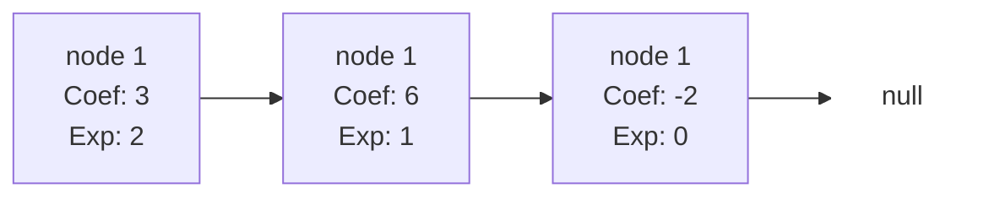
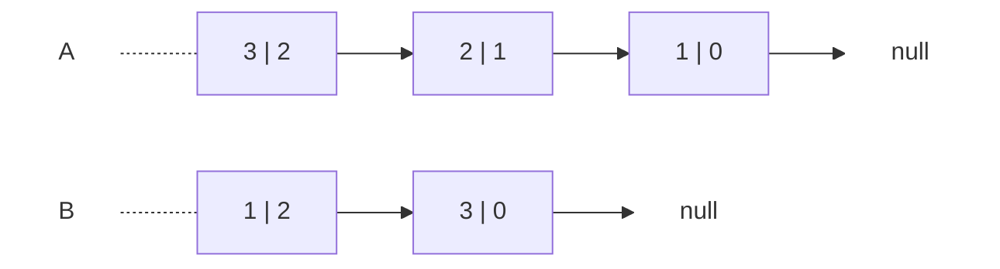
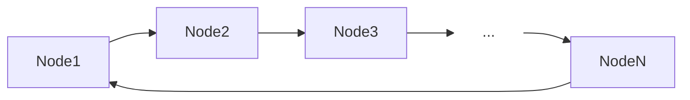
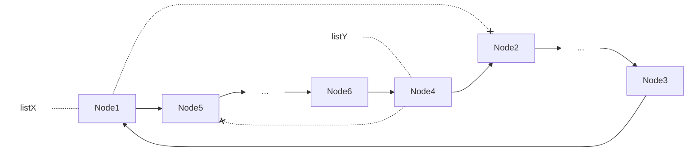
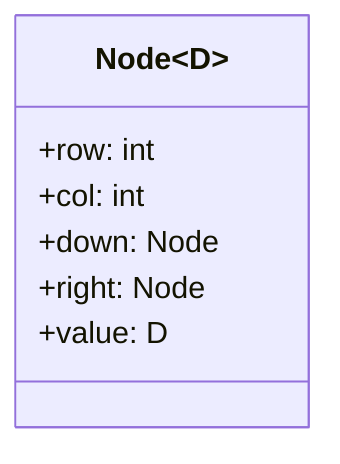
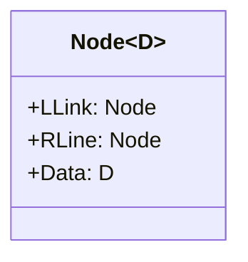

# 串列結構

-   [串列結構](#串列結構)
    -   [動態配置記憶體](#動態配置記憶體)
    -   [單向鏈結串列](#單向鏈結串列)
        -   [建立單向鏈結串列](#建立單向鏈結串列)
        -   [單向鏈結串列刪除節點](#單向鏈結串列刪除節點)
        -   [單向鏈結串列插入新節點](#單向鏈結串列插入新節點)
        -   [單向鏈結串列的反轉](#單向鏈結串列的反轉)
        -   [單向鏈結串列的連結](#單向鏈結串列的連結)
        -   [多項式串列表示法](#多項式串列表示法)
    -   [環狀鏈結串列](#環狀鏈結串列)
        -   [環狀鏈結串列的節點插入](#環狀鏈結串列的節點插入)
        -   [環狀鏈結串列的節點刪除](#環狀鏈結串列的節點刪除)
        -   [環狀串列的連結](#環狀串列的連結)
        -   [稀疏矩陣串列表示法](#稀疏矩陣串列表示法)
    -   [雙向鏈結串列](#雙向鏈結串列)
        -   [雙向鏈結串列的定義](#雙向鏈結串列的定義)
        -   [雙向鏈結串列的節點插入](#雙向鏈結串列的節點插入)
        -   [雙向鏈結串列節點刪除](#雙向鏈結串列節點刪除)

串列（Linked List）或稱「鏈結串列」，是由許多相同資料型態的項目，依特定順序排列而成的線性串列。

-   特性：記憶體位置不連續、隨機儲存。
-   優點：方便於資料的插入或刪除，有新資料就向系統要一塊記憶體空間，資料刪除後就把記憶體空間還給系統，不需要移動大量資料。
-   缺點：設計資料結構較為麻煩，搜尋資料無法隨機讀取，須從特定節點開始遍歷，直至目標資料。

## 動態配置記憶體

與陣列最大的差別，串列的各個元素不必是分配在連續的記憶體上。

「動態配置記憶體」（dynamic allocation）讓記憶體運用更為彈性，可於程式執行期間，依照使用者的需求，適當配置所需記憶體空間。

靜態及動態配置相比較：

| 相關比較表       | 動態配置                                                                                                               | 靜態配置                             |
| ---------------- | ---------------------------------------------------------------------------------------------------------------------- | ------------------------------------ |
| 記憶體配置       | 執行階段                                                                                                               | 編譯階段                             |
| 記憶體釋放       | 程式結束前必須釋放，否則會造成記憶體缺口。                                                                             | 不須釋放，程式結束自動歸還系統。     |
| 程式執行效能     | 較慢，因所需記憶體逼須於程式執行時才能配置。                                                                           | 較快，編譯階段已決定記憶體所需容量。 |
| 指標遺失配置位置 | 若指向動態配置空間的指標，在未釋放該位置空間前，又指向別的記憶體空間時，原本所指向的空間將無法被釋放，造成記憶體缺口。 | -                                    |

## 單向鏈結串列

「單向鏈結串列」（Single Linked List），由串列節點組成，一個節點有兩個欄位，分別是*資料欄*與*指標欄*，資料欄會儲存該節點所擁有的資料，而指標欄會指向下個節點的記憶體所在位置。

單向鏈結串列中，第一個節點叫「串列指標首」，而指標欄為 `null` 的節點叫「串列指標尾」：



雖然所有節點都知道下一個節點在哪，但卻不知道前一個節點的位置，因此在串列操作中「串列指標首」相當重要，只要首位存在，即可對整個串列進行走、加入即刪除節點，除非必要否則不可以移動串列指標首。

在其他 C 系列語言，是以「指標」（pointer）型態來處理串列型態的結構，但 C# 預設不支援指標，所以可以宣告鏈結串列為類別型態：

```cs
class Node
{
    public int data;
    public Node next;
    public Node(int data) // constructor function
    {
        this.data = data;
        this.next = null;
    }
}
```

接著宣告 LinkedList 類別，並定義兩個 Node 指標，分別指向串列指標首與串列指標尾：

```cs
class LinkedList
{
    private Node first;
    private Node last;
    // 以下定義類別的方法
    // ...
}
```

### 建立單向鏈結串列

[範例](../lib/linked-list/Single.cs)：使用者輸入資料來新增學生資料節點，並建立一個單向鏈結串列，接著走訪（traverse）每個節點來列印成績。

### 單向鏈結串列刪除節點

依據欲刪除的節點，會有三種不同情境：

1. 刪除第一個節點：只要將串列指標首指向第二個節點。

    ```mermaid
    flowchart LR
        Node1 --x Node2
        oldFirst -.- Node1
        Node2 --> Node3
        newFirst -..- Node2
        Node3 --> null
        style oldFirst stroke:none,fill:none
        style newFirst stroke:none,fill:none
        style null stroke:none,fill:none
    ```

    ```cs
    if (first.data == delNode.data)
        first = first.next;
    ```

2. 刪除中間的節點：將欲刪除的節點的*前一個節點*的指標，指向欲刪除的節點的下一個節點。

    ```mermaid
    flowchart LR
        Node1 --x Node2
        Node1 ---> Node3
        delNode -.- Node2
        Node2 --> Node3
        Node3 --> null
        style delNode stroke:none,fill:none
        style null stroke:none,fill:none
    ```

    ```cs
    newNode = first;                        // 遍歷節點的暫存空間
    preNode = first;                        // 目標是要引用到欲刪除的節點的前一個節點
    while (newNode.data != delNode.data)    // 遍歷至欲刪除的節點的前一個節點為止
    {
        preNode = newNode;                  // 暫存當前節點對象，若下一節點是欲刪除的節點，迴圈會中斷
        newNode = newNode.next;             // 引用下一個節點對象
    }
    preNode.next = delNode.next;            // 將欲刪除的節點的前一個節點的指標欄，改為引用欲刪除的節點的下一個節點
    ```

3. 刪除最後一個節點：只需將指向最後一個節點的指標欄，指向 `null` 即可。

    ```mermaid
    flowchart LR
        Node1 --> Node2
        Node2 --> null1(null)
        Node2 ---x Node3
        Node3 --> null2(null)
        style null1 stroke:none,fill:none
        style null2 stroke:none,fill:none
    ```

    ```cs
    if (last.data == delNode.data)
    {
        newNode = first;                // 目標是找到倒數第二個節點
        while (newNode.next != last)    // 持續遍歷到倒數第二個節點
            newNode = newNode.next;
        newNode.next = last.next        // 將倒數第二個節點的指標欄指向最後一個節點的指標欄
        last = newNode;                 // 更換串列的指標尾為倒數第二個節點
    }
    ```

[範例](../lib/linked-list/Score.cs)：建立一組學生成績的單向鏈結串列，輸入想要刪除的座號，就可以走訪串列，並刪除該位學生的節點。

### 單向鏈結串列插入新節點

與刪除節點同樣可分為三種情況：

1. 新節點插入第一個節點前，成為串列的首節點：將新節點指標欄指向串列首節點，再將串列指標首指向新節點。

    ```mermaid
    flowchart LR
        newFirst -.- newNode
        newNode -- point to --> Node1
        oldFirst -..- Node1
        Node1 --> Node2
        Node2 --> Node3["...rest of the nodes"]
        style newFirst stroke:none,fill:none
        style oldFirst stroke:none,fill:none
        style Node3 stroke:none,fill:none
    ```

2. 新節點插入最後一個節點之後：把最後一個節點的指標欄指向新節點，新節點再指向 `null`。

    ```mermaid
    flowchart LR
        Node1 --> Node2
        Node2 --> Node3
        Node3 --x null1["null"]
        Node3 -- point to --> newNode
        oldLast -.- Node3
        newNode --> null2["null"]
        newLast -.- newNode
        style null1 stroke:none,fill:none
        style null2 stroke:none,fill:none
        style oldLast stroke:none,fill:none
        style newLast stroke:none,fill:none
    ```

3. 將新節點插入串列中間的位置：假設新節點要插入 X 與 Y 節點之間，先將新節點指向 Y：

    ```mermaid
    flowchart LR
        Node1 --> NodeX
        newNode -- point to --> NodeY
        NodeX --> NodeY
        NodeY --> rest["... rest of the nodes"]
        style rest stroke:none,fill:none
    ```

    再將 X 指向新節點：

    ```mermaid
    flowchart LR
        Node1 --> NodeX
        newNode --> NodeY
        NodeX -- point to --> newNode
        NodeY --> rest["... rest of the nodes"]
        style rest stroke:none,fill:none
    ```

[C# 示範](../lib/linked-list/Insert.cs)插入節點：

```cs
public void Insert(Node ptr)
{
    Node tmp;
    Node newNode;

    if (IsEmpty())
    {
        first = ptr;
        last = ptr;
    }
    else
    {
        if (ptr.next == first) // 插入第一個節點
        {
            ptr.next = first;
            first = ptr;
        }
        else
        {
            if (ptr.next == null) // 插入最後一個節點
            {
                last.next = ptr;
                last = ptr;
            }
            else // 插入中間節點
            {
                newNode = first;
                tmp = first;
                while (ptr.next != newNode.next)
                {
                    tmp = newNode;
                    newNode = newNode.next;
                }
                tmp.next = ptr;
                ptr.next = newNode;
            }
        }
    }
}
```

### 單向鏈結串列的反轉

在鏈結串列中的節點特性是知道下一個節點的位置，可是卻無從得知上一個節點，因此實現串列反轉的方法通常是使用遍歷串列的方式，將每個節點的指標進行調整，使其指向前一個節點而不是後一個節點。具體步驟如下：

1. 便利原始鏈結串列，從首節點開始向後移動，同時保留對當前節點的引用以便後續操作。
2. 對於每個節點，將其指標指向前一個節點而非後一個節點。
3. 當遍歷完整個鏈結串列後，將原始尾節點（反轉後的新首節點）的指標設為空，以確保反轉後的鏈結串列的尾部。

[範例](../lib/linked-list/Reverse.cs)：將學生成績依照座號反轉列印出來。

### 單向鏈結串列的連結

對於兩個或以上的鏈結串列的連結（Concatenation），只要將串列的首尾相連即可：



用 C# 示範：

```cs
class Node(int data)
{
    public int data = data;
    public Node next;
}

class LinkedList
{
    Node first;
    Node last;

    public IsEmpty()
    {
        return first == null;
    }

    public void Print()
    {
        Node current = first;
        while (current != null)
        {
            Write($"[{current.data}]");
            current = current.next;
        }
        WriteLine();
    }

    public static LinkedList Concatenate(LinkedList head1, LinkedList head2)
    {
        LinkedList ptr = head1;
        while (ptr.last.next != null)
            ptr.last = ptr.last.next;
        ptr.last.next = head2.first;
        return head1;
    }
}
```

### 多項式串列表示法

一般來說，陣列表示法經常會出現以下困擾：

1. 多項式內容變動時，對陣列結構的影響相當大，演算法處理不易。
2. 由於陣列是靜態資料結構，所以需事先尋找一塊連續且足夠大的記憶體，容易形成空間的浪費。

若是以鏈結串列來表示多項式，就能克服以上問題，多項式的鏈結串列主要是處存非零項目，並且每一項均須符合以下資料結構：

-   COEF：表示該變數的係數。
-   EXP：表示該變數的指數。
-   LINK：表示指到下一個節點的指標。

假如多項式有 n 個非零項，且 P(x) = a<sub>n-1</sub>x<sup>en-1</sup> + a<sub>n-2</sub>x<sup>en-2</sup> + ... + a<sub>0</sub>，則可表示成：



因此 A(x) = 3x<sup>2</sup> + 6x -2 可表示為：



多項式以單向鏈結方式表示的功用，主要是在不同四則運算，如加法或減法。例如有兩個多項式 A(x)、B(x)。求兩式相加的結果 C(x)：



-   A = 3x<sup>3</sup> + 2x + 1
-   B = x<sup>2</sup> + 3

兩多項式相加，採往右逐一比較項次，比較冪次大小，當指數冪次大者，則將此節點加到 C(x)，指數冪次相同者相加，若結果非零也將此節點加到 C(x)，直到兩多項式的每一項都比較完畢為止：

1. Exp(p) = Exp(q)

    ```mermaid
    flowchart LR
        A -.-
        node1["3 | 2"] -->
        node2["2 | 1"] -->
        node3["1 | 0"] --> n1["null"]
        p -.- node1
        B -.-
        node4["1 | 2"] -->
        node5["3 | 0"] --> n2["null"]
        q -.- node4
        C -.-
        node6["4 | 2"] --> n3["null"]
        r -.- node6
        style A fill:none,stroke:none
        style B fill:none,stroke:none
        style C fill:none,stroke:none
        style n1 fill:none,stroke:none
        style n2 fill:none,stroke:none
        style n3 fill:none,stroke:none
        style p fill:none,stroke:none
        style q fill:none,stroke:none
        style r fill:none,stroke:none
    ```

2. Exp(p) > Exp(q)

    ```mermaid
    flowchart LR
        A -.-
        node1["3 | 2"] -->
        node2["2 | 1"] -->
        node3["1 | 0"] --> n1["null"]
        p -.- node2
        B -.-
        node4["1 | 2"] -->
        node5["3 | 0"] --> n2["null"]
        q -.- node5
        C -.-
        node6["4 | 2"] -->
        node7["2 | 1"] --> n3["null"]
        r -.- node7
        style A fill:none,stroke:none
        style B fill:none,stroke:none
        style C fill:none,stroke:none
        style n1 fill:none,stroke:none
        style n2 fill:none,stroke:none
        style n3 fill:none,stroke:none
        style p fill:none,stroke:none
        style q fill:none,stroke:none
        style r fill:none,stroke:none
    ```

3. Exp(p) = Exp(q)

    ```mermaid
    flowchart LR
        A -.-
        node1["3 | 2"] -->
        node2["2 | 1"] -->
        node3["1 | 0"] --> n1["null"]
        B -.-
        node4["1 | 2"] -->
        node5["3 | 0"] --> n2["null"]
        C -.-
        node6["4 | 2"] -->
        node7["2 | 1"] -->
        node8["4 | 0"] --> n3["null"]
        style A fill:none,stroke:none
        style B fill:none,stroke:none
        style C fill:none,stroke:none
        style n1 fill:none,stroke:none
        style n2 fill:none,stroke:none
        style n3 fill:none,stroke:none
    ```

## 環狀鏈結串列

單向鏈結串列中，維持串列首相當重要，由於此串列具有方向性，若串列指標首被破壞或遺失，整個串列就會遺失，並浪費整個串列的記憶體空間。

環狀鏈結串列（Circular Linked List）是把串列的最後一個節點指標指向串列首，串列將成為一個單方向的環狀串列，如此便不用擔心串列首遺失，因為任一節點都可以是串列首，也能從任一節點來追蹤其他節點，通常可做為記憶體工作區與輸出入緩衝區的處理及應用。



### 環狀鏈結串列的節點插入

-   將新節點插在第一個節點成為串列首

    ```mermaid
    flowchart LR
        newNode -->
        Node1 -->
        Node2 -->
        rest["..."] -->
        NodeN -->
        newNode
        NodeN -.-x Node1
    ```

    步驟：

    1. 將新節點指標指向原串列首。
    2. 找到串列尾，並將指標指向新節點。
    3. 將串列指標首的引用改為新節點。

-   將新節點 NodeY 插入任意節點 NodeX 之後

    ```mermaid
    flowchart LR
        Node1 -->
        Node2["Node"] -->
        rest1["..."] -->
        NodeX -.-x
        Node3["Node"] -->
        rest2["..."] -->
        NodeN -->
        Node1
        NodeX -->
        NodeY --> Node3
        style rest1 fill:none,stroke:none
        style rest2 fill:none,stroke:none
    ```

    步驟：

    1. 將 NodeY 的指標指向 NodeX 的下一個節點。
    2. 將 NodeX 的指標指向 NodeY。

### 環狀鏈結串列的節點刪除

-   刪除串列的首節點

    ```mermaid
    flowchart LR
        delNode -.-
        Node1 -.-x
        Node2 -->
        Node3 -->
        rest["..."] -->
        NodeN -->
        Node2
        NodeN -.-x Node1
        style delNode fill:none,stroke:none
        style rest fill:none,stroke:none
    ```

    步驟：

    1. 將串列指標首後移一個節點。
    2. 將最後一個節點指向新的串列指標首。

-   刪除串列中間的節點

    ```mermaid
    flowchart LR
        Node1 -->
        Node2["Node"] -.-x
        Node3["NodeX"] -->
        Node4["Node"] -->
        rest["..."] -->
        NodeN -->
        Node1
        delNode -.- Node3
        Node2 --> Node4
        style delNode fill:none,stroke:none
        style rest fill:none,stroke:none
    ```

    步驟：

    1. 找尋欲刪除的節點（NodeX）的前一個節點。
    2. 將找到的節點指向 NodeX 的下一個節點。

用 C# 演示環狀串列的插入與刪除：

```cs
class Node(int data)
{
    public int data = data;
    public Node next;
}

class CircleLinkedList
{
    Node first;
    Node last;

    public bool IsEmpty()
    {
        return first == null;
    }

    /// <summary>
    /// 插入節點
    /// </summary>
    public void Insert(Node trp)
    {
        Node tmp;
        Node newNode;
        if (IsEmpty())
        {
            first = trp;
            last = trp;
            last.next = first;
        }
        else if (trp.next == null) // 插入串列首
        {
            last.next = trp;
            last = trp;
            last.next = first;
        }
        else // 插入中間節點
        {
            newNode = first;
            tmp = first;
            while (newNode.next != trp.next)
            {
                if (tmp.next == first)
                    break;
                tmp = newNode;
                newNode = newNode.next;
            }
            tmp.next = trp;
            trp.next = newNode;
        }
    }

    /// <summary>
    /// 刪除節點
    /// </summary>
    public void Delete(Node delNode)
    {
        Node newNode;
        Node tmp;
        if (IsEmpty())
            return; // 串列已經空了
        if (first.data === delNode.data) // 要刪除的節點是串列首
        {
            first = first.next;
            if (first == null)
                return;  // 串列已經空了
        }
        else if (last.data == delNode.data) // 要刪除的節點是串列尾
        {
            newNode = first;
            while (newNode.next != last)
                newNode = newNode.next;
            newNode.next = last.next;
            last = newNode;
            last.next = first;
        }
        else // 要刪除的節點是中間的節點
        {
            newNode = first;
            tmp = first;
            while (newNode.data != delNode.data)
            {
                tmp = newNode;
                newNode = newNode.next;
            }
            tmp.next = delNode.next;
        }
    }
}
```

### 環狀串列的連結

環狀串列沒有頭尾之分，所以直接改變兩個指標就能把兩個環狀串列連結在一起。



[範例](../lib/linked-list/Circular.cs)：將兩個學生成績的環狀練鏈結串列連接後列印。

### 稀疏矩陣串列表示法

假如有以下 3 \* 3 稀疏矩陣：

```txt
    ┌ 0   0   0   ┐
A = | 12  0   0   |
    └ 0   0   -2  ┘
```

在[陣列結構](./陣列結構.md)中曾利用 3-tuple<row, col, value> 的結構來表示稀疏矩陣，優點為節省時間，但當非零項目要增刪時，會造成大量移動與程式碼撰寫不易的問題。以 3-tuple 表示如下：

| -    | row | col | val |
| ---- | --- | --- | --- |
| A(0) | 3   | 3   | 3   |
| A(1) | 2   | 1   | 12  |
| A(2) | 3   | 3   | -2  |

若是以鏈結串列來表示稀疏矩陣，在更動矩陣資料時，就不必大量移動資料，而節點將會有以下結構：



-   row：以 i 表示非零項目所在列數。
-   col：以 j 表示非零項目所在行數。
-   down：指向同一行中下一個非零項目元素的指標。
-   right：指向同一列中下一個非零項目元素的指標。
-   value：非零項目的值（a<sub>ij</sub>）。

## 雙向鏈結串列

> [!NOTE]
> 單向或環狀鏈結串列都只能單向走訪，若其中某節點斷裂，那該節點後面的資料便遺失而無法復原。

「雙向鏈結串列」（Double Linked List）每個節點都有兩個指標可以雙向通行，可以輕鬆找到前後節點，也可以由任一節點走訪到目標節點，不須經過反轉或比對節點等處理，執行速度較快，若任一節點斷裂，也可經由反向走訪，快速重建串列，但由於每個節點有兩個指標，所以在加入或刪除節點等操作時，都會花更多時間來移動指標，且較浪費空間。

### 雙向鏈結串列的定義

串列的每個節點，會有三個欄位，分別為左指標欄（LLink）、資料欄（Data）與右指標欄（RLink）：



-   LLink 指向上一個節點，而 RLink 指向下一個節點。
-   通常加上一個串列首，此串列不存任何資料，左邊指標欄指向最後一個節點，右邊指標欄指向第一個節點。
-   假設 ptr 為串列上任一節點的指標，則有：

    ```txt
    ptr = RLink(LLink(ptr)) = LLink(RLink(ptr))
    ```

若使用 C# 表示節點結構：

```cs
class Node(int data)
{
    public int data = data;
    public Node rnext;
    public Node lnext;
}
```

### 雙向鏈結串列的節點插入

> [!NOTE]
> 虛線為 LLink，而實線為 RLink。

-   將新節點插入串列的首節點前

    ```mermaid
    flowchart LR
        newNode -->
        Node1 -->
        rest["..."] -->
        NodeN --> n1["null"]
        NodeN -.->
        rest -.->
        Node1 -.->
        newNode -.-> n2["null"]
        Node1 -.-x n2
        style rest fill:none,stroke:none
        style n1 fill:none,stroke:none
        style n2 fill:none,stroke:none
    ```

    步驟：

    1. 將新節點的 RLink 指向原串列的首節點。
    2. 將原串列的首節點的 LLink 指向新節點。
    3. 將原串列的串列指標首指向新節點，而新節點的 LLink 指向 `null`。

-   將新節點插入串列的最後一個節點

    ```mermaid
    flowchart LR
        Node1 -->
        rest["..."] -->
        NodeN -->
        newNode --> n1["null"]
        newNode -.->
        NodeN -.->
        rest -.->
        Node1 -.-> n2["null"]
        NodeN --x n1
        style rest fill:none,stroke:none
        style n1 fill:none,stroke:none
        style n2 fill:none,stroke:none
    ```

    步驟：

    1. 將最後一個節點的 RLink 指向新節點。
    2. 將新節點的 LLink 指向原串列的最後一個節點，並將新節點的 RLink 指向 `null`。

-   將新節點插入 X 節點與 Y 節點之間

    ```mermaid
    flowchart LR
        Node1 -->
        NodeX -->
        newNode -->
        NodeY -->
        rest["..."] -->
        NodeN --> n1["null"]
        NodeN -.->
        rest -.->
        NodeY -.->
        newNode -.->
        NodeX -.->
        Node1 -.-> n2["null"]
        NodeX --x NodeY
        NodeY -.-x NodeX
        style rest fill:none,stroke:none
        style n1 fill:none,stroke:none
        style n2 fill:none,stroke:none
    ```

    步驟：

    1. 將 NodeX 的 RLink 指向新節點。
    2. 將新節點的 LLink 指向 NodeX。
    3. 將 NodeY 的 LLink 指向新節點。
    4. 將新節點的 RLink 指向 NodeY。

### 雙向鏈結串列節點刪除

-   刪除串列首節點

    ```mermaid
    flowchart LR
        delNode -->
        Node1 -->
        rest["..."] -->
        NodeN --> n1["null"]
        NodeN -.->
        rest -.->
        Node1 -.-> n2["null"]
        Node1 -.-x
        delNode -.-> n2
        style rest fill:none,stroke:none
        style n1 fill:none,stroke:none
        style n2 fill:none,stroke:none
    ```

    步驟：

    1. 將串列指標首指向第二個節點。
    2. 將新首節點的 LLink 指向 `null`。

-   刪除串列最後一個節點

    ```mermaid
    flowchart LR
        Node1 -->
        rest["..."] -->
        NodeN --x
        delNode --> n1["null"]
        NodeN --> n1
        delNode -.->
        NodeN -.->
        rest -.->
        Node1 -.-> n2["null"]
        style rest fill:none,stroke:none
        style n1 fill:none,stroke:none
        style n2 fill:none,stroke:none
    ```

    步驟：

    1. 將最後一個節點的前一個節點的 RLink 指向 `null` 即可。

-   刪除節點 X 與節點 Y 之間的節點

    ```mermaid
    flowchart LR
        Node1 -->
        r1["..."] -->
        NodeX --x
        delNode -->
        NodeY -->
        r2["..."] -->
        NodeN --> n1["null"]
        NodeN -.->
        r2 -.->
        NodeY -.-x
        delNode -.->
        NodeX -.->
        r1 -.->
        Node1 -.-> n2["null"]
        NodeX --> NodeY
        NodeY -.-> NodeX
    ```

    步驟：

    1. 將 NodeX 的 RLink 指向 NodeY。
    2. 將 NodeY 的 LLink 指向 NodeX。

以 C# 實際演示雙向鏈結串列的資料結構、建立、節點加入與刪除：

```cs
class Node(int data)
{
    public int data = data;
    public Node rnext;
    public Node lnext;
}

class DoublyLinkedList
{
    Node first;
    Node last;

    public bool IsEmpty()
    {
        return first == null;
    }

    public void Insert(Node newN)
    {
        Node tmp;
        Node newNode;
        if (IsEmpty())
        {
            first = newN;
            first.rnext = last;
            last = newN;
            last.lnext = first;
        }
        else
        {
            if (newN.lnext == null) // 插入串列首的位置
            {
                first.lnext = newN;
                newN.rnext = first;
                first = newN;
            }
            else
            {
                if (newN.rnext == null) // 插入串列尾的位置
                {
                    last.rnext = newN;
                    newN.lnext = last;
                    last = newN;
                }
                else // 插入中間節點的位置
                {
                    newNode = first;
                    tmp = first;
                    while (newN.rnext != newNode.rnext)
                    {
                        tmp = newNode;
                        newNode = newNode.rnext;
                    }
                    tmp.rnext = newN;
                    newN.rnext = newNode;
                    newNode.lnext = newN;
                    newN.lnext = tmp;
                }
            }
        }
    }

    public void Delete(Node delNode)
    {
        Node newNode;
        Node tmp;
        if (first == null)
            return;
        if (delNode == null)
            return;
        if (first.data == delNode.data) // 刪除串列首
        {
            first = first.rnext;
            first.lnext = null;
        }
        else if (last.data == delNode.data) // 刪除串列尾
        {
            last = last.lnext;
            last.rnext = null;
        }
        else // 刪除中間的節點
        {
            newNode = first;
            tmp = first;
            while (newNode.data != delNode.data)
            {
                tmp = newNode;
                newNode = newNode.rnext;
            }
            tmp.rnext = delNode.rnext;
            tmp.lnext = delNode.lnext;
        }
    }
}
```
