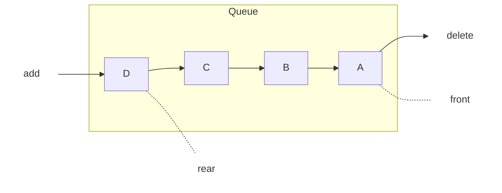
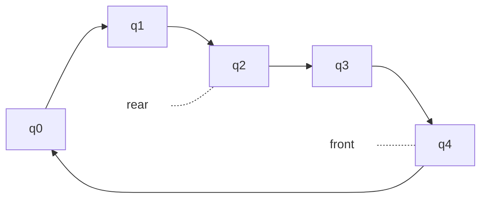
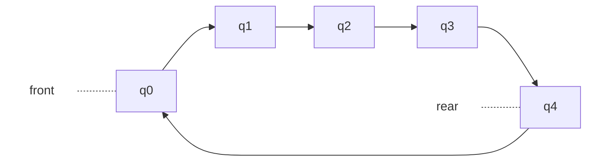
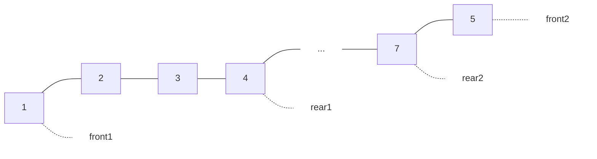
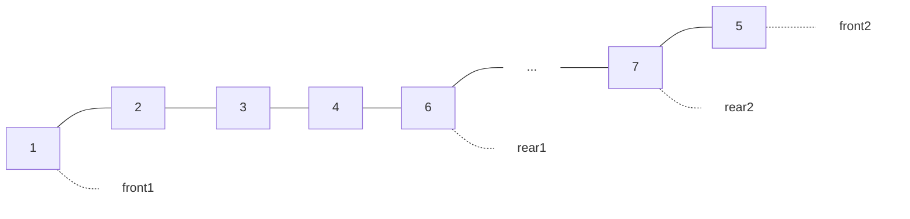

# 佇列

佇列（Queue）也是一種有序串列，也屬於一種 ADT，所有加入與刪除的動作都發生在不同的兩端，並符合先進先出（First In, First Out）的特性。

-   [佇列](#佇列)
    -   [認識佇列](#認識佇列)
        -   [佇列的工作運算](#佇列的工作運算)
        -   [佇列的陣列實作](#佇列的陣列實作)
        -   [串列實作佇列](#串列實作佇列)
    -   [佇列的應用](#佇列的應用)
        -   [環狀佇列](#環狀佇列)
        -   [雙向佇列](#雙向佇列)
        -   [優先佇列](#優先佇列)

## 認識佇列

佇列同樣可以用陣列或串列來模擬，不過堆疊只需一個 top 指標指向堆疊頂端，而佇列必須使用 front 和 rear 兩個指標分別指向頭部跟尾部：

### 佇列的工作運算

由於佇列是一種 ADT，所以它具備以下特性：

1. 先進先出（FIFO）
2. 基本動作有加入與刪除
3. 使用 front 與 rear 指標分別指向佇列頭部與尾部

而佇列的基本運算可具備以下五種工作定義：

| Action | Description                      |
| ------ | -------------------------------- |
| Create | 建立空佇列                       |
| Add    | 將新資料加入佇列尾端，傳回新佇列 |
| Delete | 刪除佇列前端的資料，傳回新佇列   |
| Front  | 傳回新佇列前端的值               |
| Empty  | 佇列是否為空                     |

### 佇列的陣列實作

嘗試[實作佇列的工作運算](../lib/queue/QueueArray.cs)，其中佇列宣告為 `queue[20]`，且一開始 front 與 rear 均預設 -1 表示空佇列。

在上述的實作中，會產生一個小問題，當 rear=19 時（佇列最大容量），再怎麼取出資料，都不能將新資料加入佇列中，這時可以嘗試將佇列的資料統一往前挪，騰出空間給新資料加入，這種作法雖然可以解決空間浪費的問題，但若佇列中資料過多，搬移時將造成時間浪費。

### 串列實作佇列

佇列除了能用陣列實作，也能使用[鏈結串列實作](../lib/queue/QueueList.cs)，宣告佇列類別時，除了要有佇列操作相關方法外，還必須要有指向佇列頭尾端的指標（front and rear）。

## 佇列的應用

佇列在電腦領域的應用包括：

-   計算機模擬（Simulation）
-   CPU 工作排程（Job Scheduling）
-   圖形走訪的先廣後深搜尋法（BFS）
-   線上同時周邊作業系統

### 環狀佇列

環狀佇列（Circular Queue）是一種環形結構的佇列，它仍是一種 Q(0:n-1) 的線性一維陣列，同時 Q(0) 為 Q(n-1) 的下一個元素，可用來解決無法判斷佇列是否滿溢的問題。

front 永遠以逆時鐘方向指向佇列中首元素的前一個位置，rear 則指向佇列目前最後的位置，剛開始 front 與 rear 都預設 -1，也就是當 front = rear = -1 時表示空佇列。

之所以將 front 指向佇列首元素的前一位，原因是當環狀佇列為空或滿時，front 跟 rear 都會指向同一個地方，如此一來便無法用 front = rear 判斷當前為空佇列或滿佇列。

為了解決這問題，除了上面這種犧牲最後一個儲存空間的方法，也可以用「當 rear 指向的下一個位置是 front」來判斷佇列已滿。

嘗試實作一個[環狀佇列的工作運算](../lib/queue/CircularQueue.cs)。

### 雙向佇列

[雙向佇列（Deques）](../lib/queue/Deques.cs)是 Double-ends Queues 的縮寫，雙向佇列就是一種前後兩端都可輸入或取出資料的有序串列。

在雙向佇列中，我們仍然使用 2 個指標，分別指向加入及取回端，只是加入及取回時，各指標所扮演的角色不再是固定的加入或取回，而且兩邊的指標都是住列中央移動，其他部份則與一般佇列無異。

假設我們嘗試利用雙向佇列循序輸入 1 ~ 7 七組數字，是問能否得到 5174236 的輸出排列？

要輸出 5174236 的話，6 為最後一位，所以可得以下 deque：

由上圖可明顯得知，無法輸出 5174236 的排列。

### 優先佇列

優先佇列（Priority Queue）是一種不必遵守佇列特性 FIFO 的有序串列，其中的每一個元素都賦予一個優先權，加入元素時可以任意加入，但有最高優先權者（Highest Priority Out First, HPOF）則最先輸出。

> 電腦中 CPU 的工作排程，優先權排程（Priority Scheduling, PS）就是一種挑選行程的「排程演算法」（Scheduling Algorithm），也會使用到優先佇列，好比層級高的使用者，就比一般使用者擁有較高的權利。

假設有 4 個排程 P1 ~ P4，在很短的時間內先後到達等待佇列，每個行程所執行時間如下：

| 行程名稱 | 各行程所需執行時間 |
| -------- | ------------------ |
| P1       | 30                 |
| P2       | 40                 |
| P3       | 20                 |
| P4       | 10                 |

在此設定 P1 ~ P4 的優先次序值分別為 2、8、6、4（數字越大、優先權越高），以下就是以甘特圖繪出優先權排程的排班情況：

```mermaid
gantt
    dateFormat SSS
    axisFormat %L
    P2: p2, 0, 40ms
    P3: 20ms
    P4: 10ms
    P1: 30ms
```

當各元素以輸入先後次序為優先權時，就是一般的佇列，若是以輸入先後次序作為**最不優先權**時，此優先佇列即是一堆疊。
