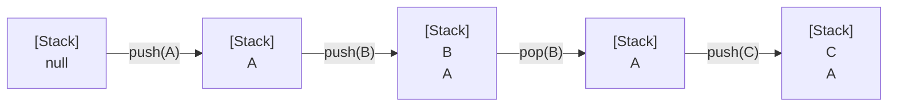

# 堆疊

## 簡介

堆疊（Stack）是一群相同資料型態的組合，所有動作均在頂端進行，並具「後進先出」（Last In, First Out: LIFO）的特性。

> [!NOTE]
> 現實生活的類比可將堆疊比喻為整疊餐盤，無論要拿取或放入餐盤，都要在整疊餐盤頂端進行。

堆疊是一種典型的 ADT（抽象資料結構），並具有以下特性：

-   只能從堆疊頂端存取資料。
-   資料存取須符合「後進先出」（Last In, First Out: LIFO）的原則。

堆疊基本運算可具備五種工作定義：

| 動作   | 說明               |
| ------ | ------------------ |
| CREATE | 建立一個空堆疊。   |
| PUSH   | 存放頂端資料。     |
| POP    | 刪除頂端資料。     |
| EMPTY  | 判斷堆疊是否為空。 |
| FULL   | 判斷堆疊是否已滿。 |

### 陣列實作堆疊

以陣列結構製作堆疊的好處是製作與設計的演算法都相當簡單，但若堆疊本身是變動的，陣列大小無法事先宣告，太大會浪費空間，太小又不夠用。

-   [範例](../lib/stack/StackArray.cs)：使用迴圈來控制準備進入或取出堆疊的元素，並模擬堆疊的各種工作。
-   [範例](../lib/stack/Shuffle.cs)：用陣列模擬撲克牌洗牌及發牌的過程，以亂數取得撲克牌後放入堆疊，放滿 52 張後開始發牌。

### 串列實作堆疊

使用鏈結串列製作堆疊的優點是隨時可以動態改變串列的長度，但缺點是設計時演算法較為複雜。

-   [範例](../lib/stack/StackList.cs)：使用迴圈來控制準備進入或取出堆疊的元素，並模擬堆疊的各種工作。
