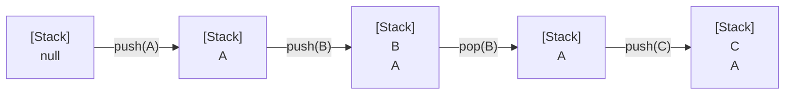
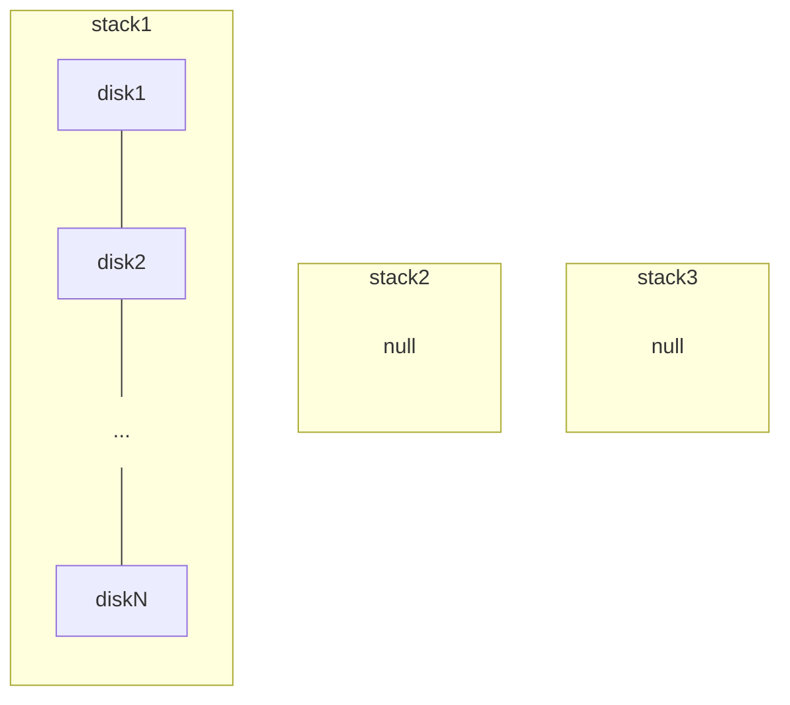
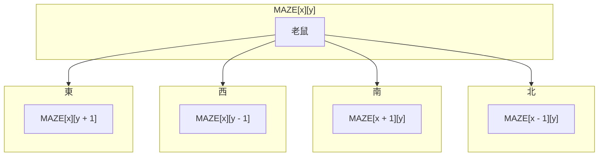

# 堆疊

## 簡介

堆疊（Stack）是一群相同資料型態的組合，所有動作均在頂端進行，並具「後進先出」（Last In, First Out: LIFO）的特性。

> [!NOTE]
> 現實生活的類比可將堆疊比喻為整疊餐盤，無論要拿取或放入餐盤，都要在整疊餐盤頂端進行。

堆疊是一種典型的 ADT（抽象資料結構），並具有以下特性：

-   只能從堆疊頂端存取資料。
-   資料存取須符合「後進先出」（Last In, First Out: LIFO）的原則。



堆疊基本運算可具備五種工作定義：

| 動作   | 說明               |
| ------ | ------------------ |
| CREATE | 建立一個空堆疊。   |
| PUSH   | 存放頂端資料。     |
| POP    | 刪除頂端資料。     |
| EMPTY  | 判斷堆疊是否為空。 |
| FULL   | 判斷堆疊是否已滿。 |

### 陣列實作堆疊

以陣列結構製作堆疊的好處是製作與設計的演算法都相當簡單，但若堆疊本身是變動的，陣列大小無法事先宣告，太大會浪費空間，太小又不夠用。

-   [範例](../lib/stack/StackArray.cs)：使用迴圈來控制準備進入或取出堆疊的元素，並模擬堆疊的各種工作。
-   [範例](../lib/stack/Shuffle.cs)：用陣列模擬撲克牌洗牌及發牌的過程，以亂數取得撲克牌後放入堆疊，放滿 52 張後開始發牌。

### 串列實作堆疊

使用鏈結串列製作堆疊的優點是隨時可以動態改變串列的長度，但缺點是設計時演算法較為複雜。

-   [範例](../lib/stack/StackList.cs)：使用迴圈來控制準備進入或取出堆疊的元素，並模擬堆疊的各種工作。

## 堆疊的應用

-   二元樹及森林的走訪運算，如中序追蹤（Inorder）、前序追蹤（Preorder）等。
-   CPU 的中斷處理（Interrupt Handling）。
-   圖形的深度優先（DFS）追蹤法。
-   某些所謂堆疊計算機（Stack Computer），是一種採用空位置（zero-address）指令，其指令沒有運算元欄大部分透過彈出（Pop）及壓入（Push）兩個指令來處理程式。
-   遞迴式的呼叫及返回：每次遞迴前，先將下一個指令的位置及變數的值保存到堆疊中。當之後遞迴回來（Return）時，則循序從堆疊頂端取出這些相關值，回到原來執行遞迴前的狀況，再往下執行。
-   算術式的轉換和求值，例如中序法轉換成後序法。
-   呼叫副程式及返回處理，例如要執行呼叫的副程式前，必須先將返回的位置（即下一到指令的位址）儲存到堆疊中，然後才執行呼叫副程式的動作，等到副程式執行完畢後，再從堆疊中取出返回位址。
-   編譯錯誤處理（Compiler Syntax Processing）：例如當編譯程式發生錯誤或警告訊息時，會將所在的位址堆入堆疊中，才顯示出錯誤相關的訊息對照表。

### 河內塔演算法

源自[河內塔（Tower of Hanoi）](https://en.wikipedia.org/wiki/Tower_of_Hanoi)智力遊戲，是典型使用遞迴式與堆疊觀念來解決問題的範例。



在搬動塔中套環時，須遵守以下規則：

1. 直徑小的套環永遠在直徑大的套環之上。
2. 套環可以任意地由任一木樁移到其他木樁上。
3. 每次只能移動一個套環，且只能移動木樁上最上面的套環。

假設套環總數為 n，列舉 n 分別等於 1~3 時的情境：

-   n = 1

    1. 直接將 disk1 移動到 stack3

    ```mermaid
    flowchart LR
        subgraph stack1
            d1["disk1"]
        end
        subgraph stack2
            null
        end
        subgraph stack3
            d2["<br>"]
        end
        d1 --> d2
        stack1 -.- stack2 -.- stack3
        style null fill:none,stroke:none
        style d2 fill:none,stroke-dasharray:5 5
        linkStyle 1,2 stroke:none
    ```

-   n = 2

    1. 將 disk1 移動到 stack2

        ```mermaid
        flowchart LR
            subgraph stack1
                direction TB
                disk1 --- disk2
            end
            subgraph stack2
                d["<br>"]
            end
            subgraph stack3
                null
            end
            disk1 --> d
            stack1 -.- stack2 -.- stack3
            style null fill:none,stroke:none
            style d fill:none,stroke-dasharray:5 5
            linkStyle 2,3 stroke:none
        ```

    2. 將 disk2 移動到 stack3

        ```mermaid
        flowchart LR
            subgraph stack1
                disk2
            end
            subgraph stack2
                disk1
            end
            subgraph stack3
                d["<br>"]
            end
            disk2 --> d
            stack1 -.- stack2 -.- stack3
            style d fill:none,stroke-dasharray:5 5
            linkStyle 1,2 stroke:none
        ```

    3. 最後將 disk1 移動到 stack3

        ```mermaid
        flowchart LR
            subgraph stack1
                null
            end
            subgraph stack2
                disk1
            end
            subgraph stack3
                direction BT
                d["<br>"] ---
                disk2
            end
            disk1 --> d
            stack1 -.- stack2 -.- stack3
            style null fill:none,stroke:none
            style d fill:none,stroke-dasharray:5 5
            linkStyle 2,3 stroke:none
        ```

    結論：

    -   移動了 2<sup>2</sup> - 1 = 3 次，disk 移動次序為 1, 2, 1。
    -   stack 變動次序為 1 -> 2，1 -> 3，2 -> 3。

-   n = 3

    1. 將 disk1 移動到 stack3

        ```mermaid
        flowchart LR
            subgraph stack1
                direction TB
                disk1 --- disk2 --- disk3
            end
            subgraph stack2
                null
            end
            subgraph stack3
                d["<br>"]
            end
            disk1 --> d
            stack1 --- stack2 --- stack3
            style null fill:none,stroke:none
            style d fill:none,stroke-dasharray:5 5
            linkStyle 3,4 stroke:none
        ```

    2. 將 disk2 移動到 stack2

        ```mermaid
        flowchart LR
            subgraph stack1
                direction TB
                disk2 --- disk3
            end
            subgraph stack2
                d["<br>"]
            end
            subgraph stack3
                disk1
            end
            disk2 --> d
            stack1 --- stack2 --- stack3
            style d fill:none,stroke-dasharray:5 5
            linkStyle 2,3 stroke:none
        ```

    3. 將 disk1 移動到 stack2

        ```mermaid
        flowchart LR
            subgraph stack1
                disk3
            end
            subgraph stack2
                direction TB
                d["<br>"] --- disk2
            end
            subgraph stack3
                disk1
            end
            disk1 --> d
            stack1 --- stack2 --- stack3
            style d fill:none,stroke-dasharray:5 5
            linkStyle 2,3 stroke:none
        ```

    4. 將 disk3 移動到 stack3

        ```mermaid
        flowchart LR
            subgraph stack1
                disk3
            end
            subgraph stack2
                direction TB
                disk1 --- disk2
            end
            subgraph stack3
                d["<br>"]
            end
            disk3 --> d
            stack1 --- stack2 --- stack3
            style d fill:none,stroke-dasharray:5 5
            linkStyle 2,3 stroke:none
        ```

    5. 將 disk1 移動到 stack1

        ```mermaid
        flowchart LR
            subgraph stack1
                d["<br>"]

            end
            subgraph stack2
                direction TB
                disk1 --- disk2
            end
            subgraph stack3
                disk3
            end
            disk1 --> d
            stack1 --- stack2 --- stack3
            style d fill:none,stroke-dasharray:5 5
            linkStyle 2,3 stroke:none
        ```

    6. 將 disk2 移動到 stack3

        ```mermaid
        flowchart LR
            subgraph stack1
                disk1
            end
            subgraph stack2
                disk2
            end
            subgraph stack3
                direction TB
                d["<br>"] --- disk3
            end
            disk2 --> d
            stack1 --- stack2 --- stack3
            style d fill:none,stroke-dasharray:5 5
            linkStyle 2,3 stroke:none
        ```

    7. 最後將 disk1 移動到 stack3

        ```mermaid
        flowchart LR
            subgraph stack1
                disk1
            end
            subgraph stack2
                null
            end
            subgraph stack3
                direction TB
                d["<br>"] --- disk2 --- disk3
            end
            disk1 --> d
            stack1 --- stack2 --- stack3
            style d fill:none,stroke-dasharray:5 5
            linkStyle 3,4 stroke:none
        ```

    結論：

    -   移動了 2<sup>3</sup> - 1 = 7 次，disk 移動次序為 1, 2, 1, 3, 1, 2, 1。
    -   stack 變動次序為 1 -> 3，1 -> 2，3 -> 2，1 -> 3，2 -> 1，2 -> 3，1 -> 3。

當 n = 4 時，總共會移動 2<sup>4</sup> - 1 = 15 次，disk 移動順序是 121312141213121，stack 變動次序是 12, 13, 23, 12, 31, 32, 12, 13, 23, 21, 31, 23, 12, 13, 23。

藉由上述示例可得出結論，當有 n 個 disk 時，可將河內塔歸納成三個步驟：

1. 將 n - 1 個 disk，從 stack1 移動到 stack2。
2. 將 disk<sub>n</sub>，從 stack1 移動到 stack3。
3. 將 n - 1 個 disk，從 stack2 移動到 stack3。

總的來說，河內塔問題滿足遞迴式的兩大特性：

1. 有反覆執行的過程
2. 有停止的出口

[示範](../lib/stack/Tower.cs)：河內塔問題演算法。

### 回朔法 - 老鼠走迷宮

回朔法（Backtracking）也算是枚舉法中的一種，對某些問題而言，回朔法是一種可以找出所有（或部分）解的一般性演算法，可以隨時避免枚舉不正確的數值，一旦發現不正確的數值，就不遞迴至下一層，而是回朔至上一層來節省時間。

> [!NOTE]
> 走不通就退回在走的方式，主要是在搜尋過程中尋找問題解，當發現已無法滿足求解條件，立即止損返回，嚐試別的路徑，避免搜索無效。

老鼠走迷宮就是一種回朔法與堆疊的應用，假設把一隻老鼠放在大迷宮盒的入口，盒中有許多牆使大部分的路徑都被擋住無法前進，老鼠在行進時必須遵守以下三點規定：

1. 一次只能走一格。
2. 遇到牆無法前進時，就退回一步看看有沒有其他條路能走。
3. 走過的路不會再走第二次。

假設要在電腦中表現模擬迷宮，可以利用二維陣列 `MAZE[row][col]`，並符合以下規則：

-   `MAZE[i][j] = 1` 表示 `[i][j]` 處有牆，過不去。
-   `MAZE[i][j] = 0` 表示 `[i][j]` 處沒有牆，可通行。
-   `MAZE[1][1]` 是入口，`MAZE[m][n]` 是出口。

以 10 \* 12 二維陣列示範：

```txt
1  1   1   1   1   1   1   1   1   1   1   1
1 [0]  0   0   1   1   1   1   1   1   1   1
1  1   1   0   1   1   0   0   0   0   1   1
1  1   1   0   1   1   0   1   1   0   1   1
1  1   1   0   0   0   0   1   1   0   1   1
1  1   1   0   1   1   0   1   1   0   1   1
1  1   1   0   1   1   0   1   1   0   1   1
1  1   1   1   1   1   0   1   1   0   1   1
1  1   0   0   0   0   0   0   1   0  {0}  1
1  1   1   1   1   1   1   1   1   1   1   1
```

-   `[0]`：入口
-   `{0}`：出口

假設老鼠目前位置是 `MAZE[x][y]`，那麼可推測老鼠可能移動的方向表示如下：



可以利用鏈結串列紀錄走過的，並將走過的位置的陣列元素內容標示為 2，然後將這個位置放入堆疊再進行下一次的選擇，由於每次新加入的位置必定會在堆疊的最末端，因此堆疊末端指標所指的方格編號便是目前搜尋迷宮出口的老鼠所在的位置。

以演算法表示：

```cs
if (上一格可走)
{
    加入方格編號到堆疊;
    往上走;
    判斷是否為出口;
}
else if (下一格可走)
{
    加入方格編號到堆疊;
    往下走;
    判斷是否為出口;
}
else if (左一格可走)
{
    加入方格編號到堆疊;
    往左走;
    判斷是否為出口;
}
else if (右一格可走)
{
    加入方格編號到堆疊;
    往右走;
    判斷是否為出口;
}
else
{
    從堆疊刪除一方格編號;
    從堆疊取出一方格編號;
    往回走;
}
```

[範例](../lib/stack/Maze.cs)：迷宮問題實作。

### 八皇后問題

> [!NOTE]
> 應用在 4 _ 4 的棋盤稱為 4-皇后問題，應用在 8 _ 8 的棋盤稱為 8-皇后問題，而 N \* N 的棋盤稱為 N-皇后問題。

在西洋棋中的皇后可以在沒有限定一步走幾格的前題下，對棋盤中的其他棋子直吃、橫吃及對角線吃，只要後放入的新皇后，放入前必須考慮所放位置的直線方向、橫線方向或對角線方向是否已有舊皇后，否則就會被舊皇后吃掉。

當棋盤中放入一個新皇后，且這位置不會被先前放置的皇后吃掉，就將這新皇后的位置存入堆疊。但當新皇后的位置的該行或該列的 8 個位置，都沒辦法放入新皇后，就必須從堆疊取出前一個皇后的位置，並於該行或該列重新尋找另一個新的位置，再將該位置存入堆疊中，而此種方式就是一種回朔（Backtracking）演算法的應用概念。

N-皇后的解法，就是配合堆疊及回朔兩種資料結構的概念，逐行逐列找新皇后的位置。

[範例](../lib/stack/Eight.cs)：計算八皇后問題有幾組解。

## 算術運算式的求值法

一個算術運算式由運算子與運算元組成，例如：

```txt
(6 * 2 + 5 * 9) / 3
```

以上範例稱為「中序表示法」（Infix Notation），也是一般人習慣的寫法，運算過程需注意運算子優先權與括號等。

其他表示法有：

1. 中序法（infix）

    ```txt
    <運算元1><運算子><運算元2>
    ```

2. 前序法（prefix）

    ```txt
    <運算子><運算元1><運算元2>
    ```

3. 後序法（postfix）

    ```txt
    <運算元1><運算元2><運算子>
    ```

中序法有優先權與結合性的問題，不利於電腦編譯器的處理，所以電腦會將它轉換成後序法（較常用）或前序法。

### 中序表示法求值

求取中序表示法 2 + 3 \* 4 - 5 的值：

1. 運算式使用兩個堆疊分別存放運算子與運算元：

    ```txt
    operant: []
    operator: []
    ```

2. 依序將運算式存入堆疊，遇到兩個運算子時比較優先權在決定是否先行運算：

    ```txt
    operant: [+]
    operator: [2, 3]
    ```

3. 遇到 \*，與堆疊最後一個運算子 + 比較後優先權較高，存入堆疊：

    ```txt
    operant: [+, *]
    operator: [2, 3, 4]
    ```

4. 遇到運算子 +，與堆疊中最後一個運算子 \* 比較，優先權較低，故先計算運算子 \* 的值。取出運算子 \* 及兩個運算元進行運算，運算完畢則存回運算元堆疊：

    ```txt
    operant: [+]
    operator: [2, (3 * 4)]
    ```

5. 把運算子 - 及運算元 5 存入堆疊，等運算式完全處理後，開始進行清除堆疊內運算子的動作，等運算子清理完畢結果也就完成了：

    ```txt
    operant: [+, -]
    operator: [2, (3 * 4), 5]
    ```

6. 取出一個運算子與兩個運算元，運算完畢存入運算元堆疊，直到運算子堆疊為空。

### 前序表示法求值

好處是不需考慮括號及優先權問題，可直接使用一個堆疊來處理運算式，下面以 + \* 2 3 \* 4 5 實作：

```txt
prefix: [+, *, 2, 3, *, 4, 5]
```

1. 從堆疊中取出運算元：

    ```txt
    prefix: [+, *, 2, 3, *]
    operant: [4, 5]
    ```

2. 遇到運算子就運算，算完放回運算元堆疊：

    ```txt
    prefix: [+, *, 2, 3]
    operant: [4 * 5]
    ```

3. 繼續從堆疊中取出運算元：

    ```txt
    prefix: [+, *]
    operant: [20, 2, 3]
    ```

4. 再次運算，算完一樣放回堆疊：

    ```txt
    prefix: [+]
    operant: [20, 2 * 3]
    ```

5. 重複以上動作：

    ```txt
    prefix: []
    operant: [20 + 6]
    ```

### 後序表示法求值

與前序表示法雷同，將前序表示法的範例運算式轉為以後續表示法會是 2 3 \* 4 5 \* +。

## 中序式轉換為前序後序式

### 二元樹法

把中序運算式依優先順序，建成一顆二元樹，之後再依樹狀結構的特性進行前、中、後序的走訪，即可得到前中後序運算式。

### 括號法

先用括號把中序運算式的優先順序分出來，再移動運算子，最後把括號拿掉就完成了。

以下皆以 2 \* 3 + 4 \* 5 示範：

-   中序轉前序

    1. 將中序運算式根據順序完全括號起來。

        ```txt
        ((2 * 3) + (4 * 5))
        ```

    2. 移動所有運算子來取代所有左括號，並以最近者為原則。

        ```txt
        +*2  3) *4  5))
        ```

    3. 將所有右括號去掉。

        ```txt
        + * 2 3 * 4 5
        ```

-   中序轉後續

    1. 將中序運算式根據順序完全括號起來。

        ```txt
        ((2 * 3) + (4 * 5))
        ```

    2. 移動所有運算子來取代所有右括號，並以最近者為原則。

        ```txt
        ((2  3*  (4  5*+
        ```

    3. 將所有左括號去掉。

        ```txt
        2 3 * 4 5 * +
        ```

### 堆疊法

> [!NOTE]
> ISP（In Stack Priority）是「堆疊內優先權」，而 ICP（In Coming Priority）是「輸入優先權」。

-   中序轉前序

    1. 由右至左讀進中序運算式的每個字元
    2. 如果輸入為運算元則直接輸出
    3. `)` 在堆疊中的優先權最小，但在堆疊外優先權最高
    4. 如果遇到 `(`，則彈出堆疊內的運算子，直到彈出一個 `)` 為止
    5. 如果 ISP > ICP 則將堆疊內的運算子彈出，否則就加入到堆疊內

-   中序轉後序

    1. 由左至右讀進中序運算式的每個字元
    2. 輸入為運算元則直接輸出
    3. 如果 ISP >= ICP，即將堆疊內的運算子直接彈出，否則就加入到堆疊內
    4. `(` 在堆疊中的優先權最小，但在堆疊外優先權最高
    5. 如果遇到 `)`，則直接彈出堆疊內的運算子，一直到彈出一個 `(` 為止

以下以堆疊法求中序式 A - B \* (C + D) / E 的前序與後序：

-   中序轉前序（從右至左讀入字元）

    | 讀入字元 | 堆疊內容 | 輸出 | 說明                                                         |
    | -------- | -------- | ---- | ------------------------------------------------------------ |
    | None     | Empty    | None |                                                              |
    | E        | Empty    | E    | 字元是運算元就直接輸出                                       |
    | /        | /        | E    | 將運算子加入堆疊中                                           |
    | )        | )/       | E    | `)` 在堆疊中優先權較小                                       |
    | D        | )/       | DE   |                                                              |
    | +        | +)/      | DE   |                                                              |
    | C        | +)/      | CDE  |                                                              |
    | (        | /        | +CDE | 彈出堆疊內運算子，直到 `)` 為止                              |
    | \*       | \*/      | +CDE | 雖然 `*` 的 ICP 和 `/` 的 ISP 相等，但在中序轉前序時不必彈出 |

-   中序轉後序（從左至右讀入字元）
