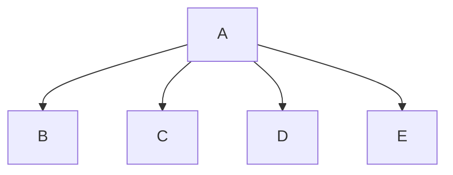
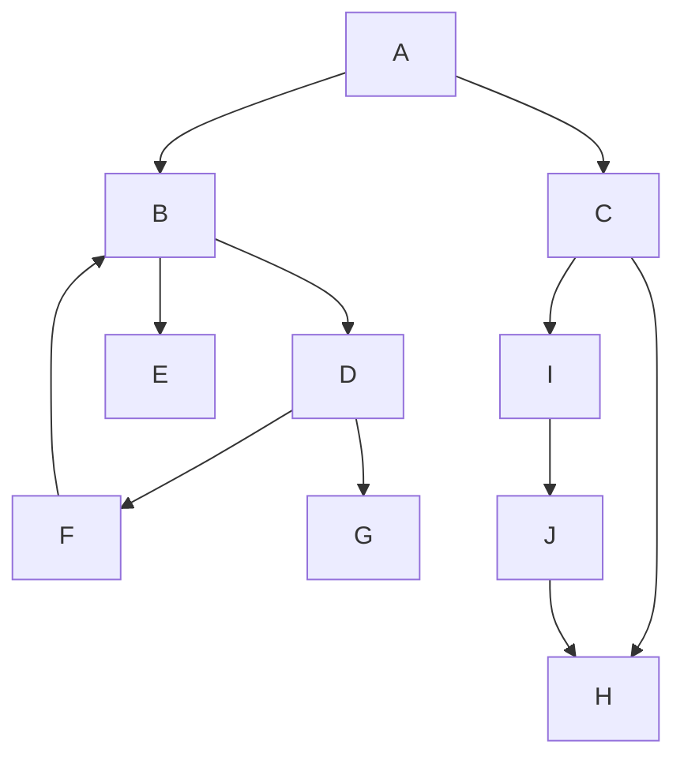
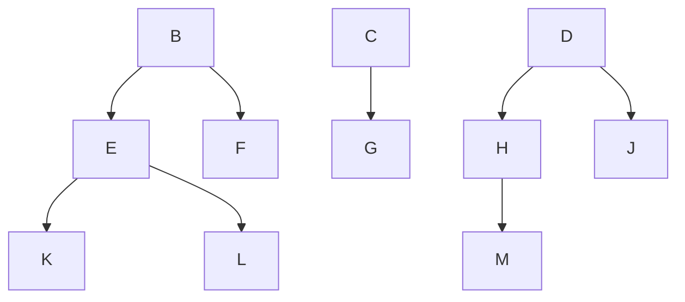
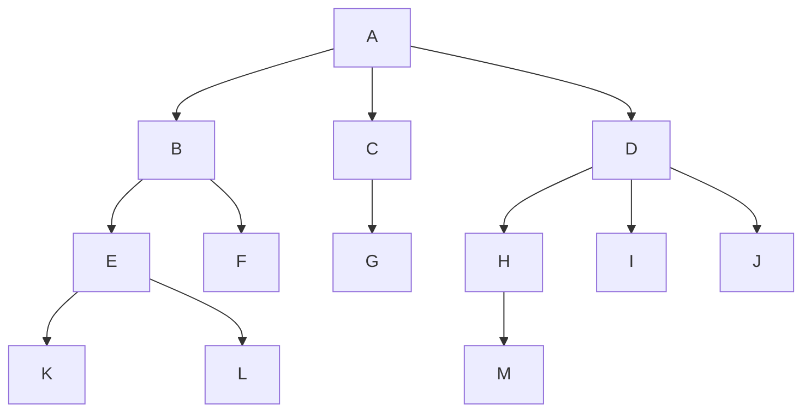
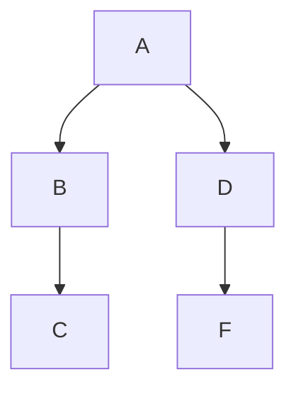

# 樹狀結構

樹狀結構為應用相當廣泛的**非線性結構**，應用範圍包含：

-   組織圖
-   族譜
-   賽程
-   作業系統
-   資料庫管理系統
-   檔案管理系統

又或者像線上遊戲中，程式設計師也會使用樹狀結構中的二元空間分割樹（BSP tree）、四元樹（Quadtree）、八元樹（Octree）等來分割場景資訊。

## 樹的基本觀念

「樹」（Tree）是由單或多個節點（Node）組成，並存在一個根節點（Root），每個節點可代表一些資料與指標組合而成的紀錄，其餘節點則可分為 n >= 0 個互斥的集合，即是 T<sub>1</sub>、T<sub>2</sub>、T<sub>3</sub> ... T<sub>n</sub>，則每個子集合本身也是一種樹狀結構即此根節點的子樹。

如下圖所示，A 為根節點，B、C、D、E 為 A 的子節點：



一個合法的樹，節點間可以互相連結，但不能行成無出口的迴圈，例如下圖：



樹還可以組成「樹林」（forest），也就是由 n 個互斥樹的集合（n >= 0），移去樹根即為樹林，利如下圖就是包含三棵樹的樹林：



### 樹的專有名詞

本小節將以下圖這顆合法樹來介紹一些專有名詞：



| 中文名稱      | 英文名稱              | 說明                                                                                 |
| ------------- | --------------------- | ------------------------------------------------------------------------------------ |
| 分支度        | Degree                | 每個節點所擁有的子樹個數。例如 B 分支度為 2、D 分支度為 3。                          |
| 階層/階度     | Level                 | 樹的層級。若 A 為第 1 層，B、C、D 為第 2 層，而 E、F、G、H、I、J 為第 3 層。         |
| 高度          | Height                | 樹的最大階度。上圖為 4。                                                             |
| 樹葉/終端節點 | Leaf / Terminal Nodes | 分支度為 0 的節點。                                                                  |
| 父節點        | Parent                | 每個節點有聯結的上一層節點為父節點。B 的父節點為 A、H 的父節點為 D、L 的父節點為 E。 |
| 子節點        | Children              | 每個節點有聯結的下一層節點。A 子節點為 B、C、D。                                     |
| 祖先          | Ancestor              | 從根節點到目標節點路徑上所有節點。K 節點的祖先有 A、B、E。                           |
| 子孫          | Descendant            | 從目標節點以下的任意節點。B 節點的子孫有 E、F、K、L。                                |
| 兄弟節點      | Siblings              | 享有共同父節點的鄰近節點。B、C、D 為兄弟，H、I、J 也為兄弟。                         |
| 非終端節點    | Nonterminal Nodes     | 樹葉以外的節點。A、B、C ...等。                                                      |
| 同代          | Generation            | 具有相同階層數的節點。B、C、D 為同代，K、L、M 也為同代。                             |
| 樹林          | Forest                | 由 n 個互斥樹的集合（n >= 0），移去樹根即為樹林。                                    |

## 二元樹簡介

一般樹狀結構在電腦的記憶體中是以鏈結串列的儲存方式為主，對於 n 元樹（n-way tree）來說，每個節點的分支度都不同，所以為了方便起見，我們必需取 n 為鏈結個數為最大固定長度。

n 元樹十分浪費鏈結空間，假設 n 元樹有 m 個節點，則此樹共用了 n \* m 個鏈結欄位。

另外，除了根節點外，每個非空鏈結都指向一個節點，可得知空鏈結個數為 n _ m - (m - 1) = m _ (n - 1) + 1，而 n 元樹的鏈結浪費率為 (m _ (n - 1) + 1) / (m _ n)，因此可以得到以下結論：

-   if (n = 2) 二元樹的浪費率約 1/2
-   if (n = 3) 三元樹的浪費率約 2/3
-   if (n = 4) 四元樹的浪費率約 3/4
-   ...以此類推

當 n = 2 時，浪費率最低，所以為了改進空間浪費的缺點，二元樹（Binary Tree）結構最常被用來取代樹狀結構。

### 二元樹的定義

二元樹（Binary / Knuth Tree）是一個由有限節點所組成的集合，此集合可為空集合，或由一個樹根及左右兩個子樹所組成。

> 二元樹最多只能有兩個子節點，即分支度 <= 2。

而二元樹與一般樹的不同如下：

1. 樹不可為空集合，但二元樹可以。
2. 樹的分支度為 d >= 0，但二元樹節點分支度為 0 <= d <= 2。
3. 樹的子樹間沒有次序關係，但二元樹有。

下圖為二元樹範例，其中 A 為根節點，包含了以 B、D 為根節點的兩顆互斥的左子樹與右子樹：



B 與 C 兩個左右子樹都屬同一種樹狀結構，不過卻是兩顆不同的二元樹狀結構，原因是二元樹需考慮次序關係。

### 特殊二元樹

-   **完滿二元樹（Fully Binary Tree）**

    高度為 h，節點數為 2<sup>h</sup> - 1，h >= 0。

    ```mermaid
    flowchart TB
        1 --> 2 --> 4 --> 8
        2 --> 5 --> 10
        4 --> 9
        5 --> 11
        1 --> 3 --> 6 --> 12
        3 --> 7 --> 14
        6 --> 13
        7 --> 15
    ```

-   **完整二元樹（Complete Binary Tree）**

    高度為 h，節點數小於 2<sup>h</sup> - 1，h >= 0，但其節點的編號方式如同高度為 h 的完滿二元數一般，從左至右，由上到下的順序一一對應結合。

    ```mermaid
    flowchart TB
        1["<<1>><br>11"] --> 2["<<2>><br>12"] --> 4["<<4>><br>14"]
        2 --> 5["<<5>><br>15"]
        1 --> 3["<<3>><br>13"] --> 6["<<6>><br>16"]
        3 -.- 7["<<7>><br>17<br>若是缺少了<<6>>，但卻有<<7>>，就會破壞順序對應，就不是完整二元樹了"]
        style 7 fill:none,stroke:#888
    ```

    對於完整二元樹而言，假設有 n 個節點，那麼此二元數的高度為 ⌊log<sub>2</sub>(n + 1)⌋。

-   **歪斜樹（Skewed Binary Tree）**

    當一個二元樹完全沒有左/右節點時，就稱為左/右歪斜樹。

    ```mermaid
    flowchart LR
        subgraph 左歪斜樹
            direction TB
            2[" "] --> 4[" "] --> 8[" "]
            2[" "] --- 5[" "] --- 10[" "]
            4[" "] --- 9[" "]
            5[" "] --- 11[" "]
        end
        subgraph 右歪斜樹
            direction TB
            3[" "] --- 6[" "] --- 12[" "]
            3[" "] --> 7[" "] --- 14[" "]
            6[" "] --- 13[" "]
            7[" "] --> 15[" "]
        end
        左歪斜樹 --- 右歪斜樹
        linkStyle 2,3,4,5,6,7,9,10,12 stroke:none
        style 5 fill:none,stroke:none
        style 6 fill:none,stroke:none
        style 9 fill:none,stroke:none
        style 10 fill:none,stroke:none
        style 11 fill:none,stroke:none
        style 12 fill:none,stroke:none
        style 13 fill:none,stroke:none
        style 14 fill:none,stroke:none
    ```

-   **嚴格二元樹（Strictly Binary Tree）**

    每個非終端節點皆有非空的左/右子樹。

    ```mermaid
    flowchart TB
        1 --> 2 --> 4 --> 8
        2 --> 5
        4 --> 9
        1 --> 3
    ```
